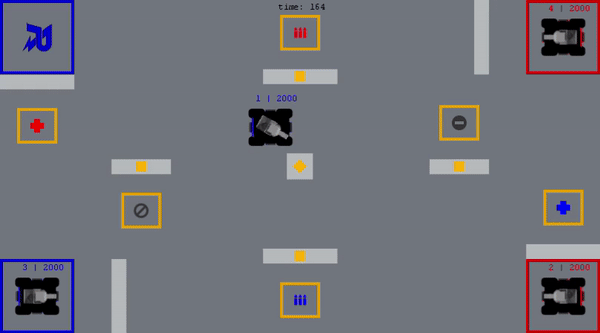

# NTU RoboMaster AI Challenge Simulator

RoboMaster AI Challenge Simulator (RMAICS), is a 2D simulation environment designed for the [ICRA 2021 RoboMaster AI Challenge](https://www.robomaster.com/en-US/robo/icra).
 Its main function is to provide a simulation environment for intelligent decision-making groups to train neural networks.
 

## 1. Dependencies

* [numpy](https://numpy.org/)
* [pygame](https://www.pygame.org/) for visualization only
* [networkx](https://networkx.org/) for waypoint navigation

## 2. User Guides

The simulation consists of two levels:
> The high-level training interface class: `rmaics`  
> The low-level implementation class: `kernel`

See the following manuals for further information.
* High-level training interface in `rmaics.py`: [rmaics.md](docs/rmaics.md)
* Low-level implementation in `kernel.py`: [kernel.md](docs/kernel.md)
* Instructions for `record_player.py`: [record_player.md](docs/record_player.md)
* Instructions for controls: [operation.md](docs/operation.md)
* Parameter format: [params.md](docs/params.md)
* Further improvements to `kernel.py`: [future.md](docs/future.md)

# This is the Reinforcement Learning Challenge. 
## Your Task, should you choose to take it, is to create an agent throught Reinforcement Learning
---
# Before you start with this challenge please FORK this repo and implement your solution in the forked repo.
## 1. Rational for this test
According to DJI, the Robomaster needs to be able to navigate in the battle arena autonomous and fire on target if opponent is spotted. Therefore, we believe Reinforcement Learning is best suitted for this task. Thus, we are recruiting students who are good at designing Reinforcement Learning Models.

## 2. Your Task
Design an agent who is able to navigate in this arena autonomously and preferable eliminate the opponent at the end of this simulation.

Please define your agent in the `rl_agent_actor.py`: [rl_agent_actor.py](rl_agent_actor.py)

## 3. Setting Up Environment
All the required library is found in the requirements.txt

To install required library:
`
pip install -r requirements.txt
`

## 4. Restriction
You are **NOT** allow to modify the environment variable (HP of Robot, Movement Speed ect).

Files that you are **NOT** allowed to modify:
* **ALL** files in the modules folder

*This simulator is adapted from UBC Robomaster AI Challenge Simulator
